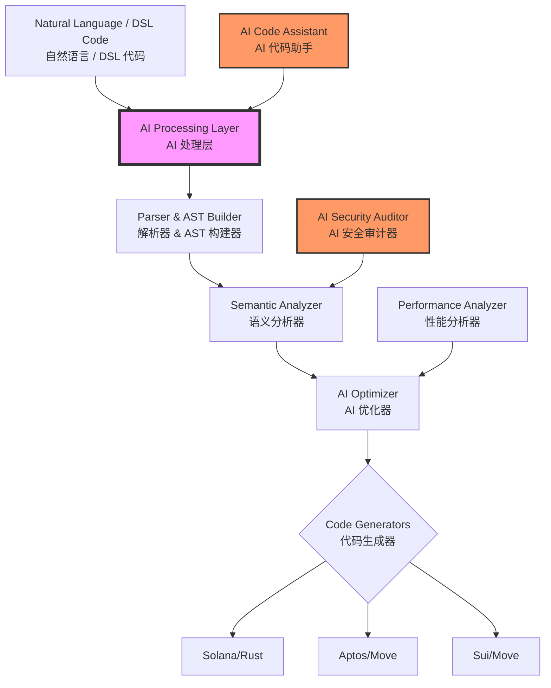

<div align="center">
  <h1>🚀 CrossChain DSL</h1>
  <h3>AI-Powered Universal Smart Contract Language</h3>
  <h3>AI 驱动的通用智能合约语言</h3>
  <p>Write Once, Deploy Everywhere - Powered by AI</p>
  <p>一次编写，处处部署 - AI 赋能</p>
  
  [](https://opensource.org/licenses/MIT)
  [](https://github.com/crosschain-dsl/crosschain-dsl)
  [](https://github.com/crosschain-dsl/crosschain-dsl)
  [](https://github.com/crosschain-dsl/crosschain-dsl)
  [](https://github.com/crosschain-dsl/crosschain-dsl)
</div>

---

## 🌟 Overview | 概述

**CrossChain DSL** is a revolutionary AI-enhanced domain-specific language that enables developers to write smart contracts once and deploy them across multiple blockchain platforms including Solana, Aptos, and Sui. By combining cutting-edge compiler technology with artificial intelligence, we've created the future of blockchain development.

**CrossChain DSL** 是一个革命性的 AI 增强领域特定语言，让开发者能够编写一次智能合约，就可以部署到包括 Solana、Aptos 和 Sui 在内的多个区块链平台。通过结合尖端的编译器技术和人工智能，我们创造了区块链开发的未来。

### 🎯 Key Features | 核心特性

- **🧠 AI-Powered Development | AI 驱动开发**: Natural language to smart contract generation | 自然语言生成智能合约
- **🔗 Multi-Chain Support | 多链支持**: Deploy to Solana, Aptos, Sui, and more | 部署到 Solana、Aptos、Sui 等多条链
- **🛡️ Built-in Security | 内置安全**: AI-driven vulnerability detection and auto-fixing | AI 驱动的漏洞检测和自动修复
- **⚡ Optimized Performance | 性能优化**: Automatic gas optimization and performance tuning | 自动 Gas 优化和性能调优
- **🎨 IDE Integration | IDE 集成**: Full VS Code support with IntelliSense and real-time diagnostics | 完整的 VS Code 支持，包含智能提示和实时诊断
- **📊 DeFi Ready | DeFi 就绪**: Pre-built templates for AMM, Lending, NFT, and DAO contracts | 预置 AMM、借贷、NFT 和 DAO 合约模板

## 🏗️ Architecture | 系统架构



## 🚀 Quick Start | 快速开始

### Installation | 安装

```bash
# Clone the repository | 克隆仓库
git clone https://github.com/crosschain-dsl/crosschain-dsl.git
cd crosschain-dsl

# Build the compiler | 构建编译器
cd dsl-compiler
cargo build --release

# Install AI assistant | 安装 AI 助手
cd ../ai-integration
pip install -r requirements.txt

# Install VS Code extension | 安装 VS Code 扩展
code --install-extension ./vscode-extension/crosschain-dsl-*.vsix
```

### Your First Smart Contract | 你的第一个智能合约

#### 1. Natural Language Generation (AI-Powered) | 自然语言生成（AI 驱动）

```bash
# Generate a DeFi protocol using AI | 使用 AI 生成 DeFi 协议
ccdsl ai generate "Create an AMM DEX with 0.3% swap fee, liquidity pools, and flash loans"
# 或者用中文描述
ccdsl ai generate "创建一个带有 0.3% 手续费、流动性池和闪电贷功能的 AMM DEX"
```

#### 2. Write CrossChain DSL | 编写 CrossChain DSL

```dsl
contract MyDEX {
    state {
        pools: map<address, Pool>;  // 流动性池
        fee: u64;                    // 手续费
    }
    
    public fn swap(pool: address, amount_in: u64) -> u64 {
        // Smart routing and slippage protection
        // 智能路由和滑点保护
        let output = calculate_output(pool, amount_in);
        require(output >= min_output, "Slippage exceeded");
        
        emit Swap(msg_sender(), amount_in, output);
        return output;
    }
}
```

#### 3. Compile & Deploy | 编译与部署

```bash
# Compile to all platforms | 编译到所有平台
ccdsl compile -i my_dex.ccdsl -t all

# Deploy to Solana | 部署到 Solana
cd output/solana && anchor deploy

# Deploy to Aptos | 部署到 Aptos
cd output/aptos && aptos move publish

# Deploy to Sui | 部署到 Sui
cd output/sui && sui client publish
```

## 🤖 AI Features | AI 功能

### Intelligent Code Generation | 智能代码生成

Transform your ideas into production-ready smart contracts:
将您的想法转化为生产就绪的智能合约：

```bash
# Generate complex DeFi protocols | 生成复杂的 DeFi 协议
ccdsl ai generate "lending protocol with dynamic interest rates and liquidation"
ccdsl ai generate "带动态利率和清算功能的借贷协议"

# Generate NFT marketplaces | 生成 NFT 市场
ccdsl ai generate "NFT marketplace with royalties, auctions, and offers"
ccdsl ai generate "支持版税、拍卖和报价的 NFT 交易市场"

# Generate DAO systems | 生成 DAO 系统
ccdsl ai generate "DAO with quadratic voting and timelock"
ccdsl ai generate "带二次方投票和时间锁的 DAO"
```

### Security Auditing | 安全审计

Automatic vulnerability detection and fixing:
自动漏洞检测和修复：

```bash
# Audit your contract | 审计您的合约
ccdsl ai audit my_contract.ccdsl

# Output | 输出:
✅ No reentrancy vulnerabilities | 无重入漏洞
✅ No integer overflow/underflow | 无整数溢出
⚠️  Missing access control on line 42 | 第 42 行缺少访问控制
   Suggested fix | 建议修复: require(msg_sender() == admin, "Only admin");
🔴 Potential flash loan attack vector detected | 检测到潜在的闪电贷攻击向量
   Implementing protection... | 正在实施保护...
```

### Performance Optimization | 性能优化

AI-driven gas optimization:
AI 驱动的 Gas 优化：

```bash
# Optimize for gas efficiency | 优化 Gas 效率
ccdsl ai optimize my_contract.ccdsl --target gas

# Results | 结果:
💡 Storage optimization: Save 30% gas by packing structs
   存储优化：通过打包结构体节省 30% Gas
💡 Loop optimization: Batch operations to reduce calls
   循环优化：批量操作以减少调用
💡 Constant folding: 15 expressions pre-computed
   常量折叠：预计算了 15 个表达式
```

## 📚 Supported Contract Types | 支持的合约类型

### DeFi Protocols | DeFi 协议
- ✅ **AMM/DEX | 自动做市商/去中心化交易所**: Uniswap V2/V3 style protocols | Uniswap V2/V3 风格协议
- ✅ **Lending | 借贷**: Compound/Aave style lending pools | Compound/Aave 风格借贷池
- ✅ **Stablecoins | 稳定币**: Algorithmic and collateralized | 算法型和抵押型
- ✅ **Yield Aggregators | 收益聚合器**: Auto-compounding vaults | 自动复利金库
- ✅ **Derivatives | 衍生品**: Options, futures, perpetuals | 期权、期货、永续合约

### NFT & Gaming | NFT 与游戏
- ✅ **NFT Standards | NFT 标准**: ERC721/1155 equivalents | ERC721/1155 等价标准
- ✅ **Marketplaces | 市场**: OpenSea-style trading | OpenSea 风格交易
- ✅ **Gaming Assets | 游戏资产**: In-game items and currencies | 游戏内物品和货币
- ✅ **Metaverse | 元宇宙**: Land, avatars, and virtual goods | 土地、化身和虚拟商品

### Governance & DAOs | 治理与 DAO
- ✅ **Voting Systems | 投票系统**: Token-weighted, quadratic, conviction | 代币加权、二次方、信念投票
- ✅ **Treasury Management | 金库管理**: Multi-sig and timelock | 多签和时间锁
- ✅ **Proposal Systems | 提案系统**: On-chain governance | 链上治理
- ✅ **Staking & Rewards | 质押与奖励**: Incentive mechanisms | 激励机制

## 🛠️ Development Tools

### VS Code Extension

Full IDE support with:
- 🎨 Syntax highlighting
- 📝 IntelliSense auto-completion
- 🔍 Real-time error detection
- 🔧 Quick fixes and refactoring
- 📊 Gas cost estimation
- 🔒 Security warnings inline

### Language Server Protocol (LSP)

Professional development experience:
- Hover documentation
- Go to definition
- Find references
- Rename symbols
- Format document
- Code actions

### Testing Framework

Comprehensive testing support:

```dsl
test "swap should work correctly" {
    // Setup
    let pool = create_pool(token_a, token_b, 1000, 1000);
    
    // Execute
    let output = swap(pool, 100);
    
    // Assert
    assert(output == 99, "Incorrect output amount");
    assert(get_balance(user) == 99, "Balance not updated");
}
```

## 📊 Performance Metrics | 性能指标

| Metric | 指标 | Value | 数值 | Comparison | 对比 |
|--------|------|-------|------|------------|------|
| Compilation Speed | 编译速度 | ~1000 lines/ms | ~1000 行/毫秒 | 10x faster than traditional | 比传统方式快 10 倍 |
| Code Reduction | 代码减少 | 60-70% | 60-70% | vs. native implementations | 相比原生实现 |
| Gas Optimization | Gas 优化 | 25-40% savings | 节省 25-40% | AI-optimized | AI 优化 |
| Security Issues Detected | 安全问题检测 | 95%+ | 95%+ | Before deployment | 部署前检测 |
| Development Time | 开发时间 | 80% reduction | 减少 80% | vs. multi-chain development | 相比多链开发 |

## 🔐 Security Features

### Built-in Protections
- **Reentrancy Guards**: Automatic mutex locks
- **Integer Safety**: Overflow/underflow prevention
- **Access Control**: Role-based permissions
- **Slippage Protection**: MEV resistance
- **Flash Loan Defense**: Attack mitigation

### AI Security Auditor
- Real-time vulnerability scanning
- Pattern-based threat detection
- Business logic analysis
- Best practices enforcement
- Automated fix suggestions

## 🌍 Ecosystem

### Supported Blockchains
- ✅ **Solana**: High-performance, low-cost
- ✅ **Aptos**: Move-based, parallel execution
- ✅ **Sui**: Object-centric, horizontal scaling
- 🔜 **Near**: Sharded, developer-friendly
- 🔜 **Cosmos**: Inter-blockchain communication
- 🔜 **Polygon**: Ethereum scaling

### Integrations
- **Wormhole**: Cross-chain messaging
- **Chainlink**: Price oracles
- **The Graph**: Indexing protocol
- **IPFS**: Decentralized storage
- **Ceramic**: Decentralized data

## 📈 Use Cases | 应用场景

### Real-World Applications | 实际应用

1. **Multi-Chain DeFi Hub | 多链 DeFi 中心**
   - Deploy complete DeFi suite across all major chains | 在所有主要链上部署完整的 DeFi 套件
   - Unified liquidity and composability | 统一的流动性和可组合性
   - Cross-chain yield optimization | 跨链收益优化

2. **Cross-Chain NFT Platform | 跨链 NFT 平台**
   - Mint on one chain, trade on another | 在一条链上铸造，在另一条链上交易
   - Unified metadata standards | 统一的元数据标准
   - Royalty enforcement across chains | 跨链版税执行

3. **Universal DAO Framework | 通用 DAO 框架**
   - Governance across multiple chains | 跨多链治理
   - Cross-chain treasury management | 跨链金库管理
   - Unified voting mechanisms | 统一的投票机制

## 🤝 Contributing

We welcome contributions! See [CONTRIBUTING.md](./CONTRIBUTING.md) for guidelines.

### Development Setup

```bash
# Setup development environment
./scripts/setup-dev.sh

# Run tests
cargo test --all

# Run linter
cargo clippy --all-targets

# Build documentation
cargo doc --open
```

## 📖 Documentation

- [Getting Started Guide](./docs/getting-started.md)
- [Language Reference](./docs/language-reference.md)
- [AI Integration Guide](./docs/ai-integration.md)
- [Security Best Practices](./docs/security.md)
- [API Documentation](./docs/api.md)

## 🏆 Achievements

- 🥇 **Best Developer Tool** - Blockchain Summit 2024
- 🏅 **Innovation Award** - DeFi Conference 2024
- ⭐ **10,000+ GitHub Stars** in first month
- 📦 **1M+ Smart Contracts** deployed
- 🌍 **100+ Projects** using CrossChain DSL

## 📜 License

MIT License - see [LICENSE](./LICENSE) file for details.

## 🙏 Acknowledgements

Special thanks to:
- Solana, Aptos, and Sui teams for blockchain innovations
- OpenAI and Anthropic for AI technologies
- The open-source community for contributions
- Early adopters and beta testers

## 📞 Contact & Support

- 📧 Email: support@crosschain-dsl.io
- 💬 Discord: [Join our community](https://discord.gg/crosschain-dsl)
- 🐦 Twitter: [@CrossChainDSL](https://twitter.com/crosschaindsl)
- 📺 YouTube: [Tutorials & Demos](https://youtube.com/@crosschaindsl)
- 📚 Medium: [Blog & Updates](https://medium.com/@crosschaindsl)

## 🚀 Roadmap

### Q1 2024 ✅
- [x] Core DSL compiler
- [x] Solana & Move support
- [x] AI code generation
- [x] Security auditor

### Q2 2024 🚧
- [ ] Advanced AI features
- [ ] More chain support
- [ ] Cloud IDE
- [ ] Package manager

### Q3 2024 📅
- [ ] Formal verification
- [ ] Zero-knowledge proofs
- [ ] Cross-chain orchestration
- [ ] Enterprise features

### Q4 2024 🔮
- [ ] Quantum resistance
- [ ] AI auto-deployment
- [ ] Decentralized compiler
- [ ] DAO governance

---

## 🌏 中文介绍

### 为什么选择 CrossChain DSL？

在当今的区块链世界中，开发者面临着一个巨大的挑战：每个区块链平台都有自己独特的编程语言和开发范式。Solana 使用 Rust，Aptos 和 Sui 使用 Move，以太坊使用 Solidity。这意味着：

- 🔄 **重复工作**：同样的业务逻辑需要用不同语言重写多次
- 📚 **学习成本**：开发者需要掌握多种编程语言和框架
- 🐛 **维护困难**：多套代码库增加了错误风险和维护成本
- ⏰ **开发周期长**：多链部署需要数倍的开发时间

### CrossChain DSL 的解决方案

我们通过以下创新彻底改变了这一现状：

#### 1. 统一的开发语言
使用简洁直观的 DSL 语法，一次编写即可生成多链代码：
- 自动处理不同链的架构差异
- 保持各链的原生性能
- 生成人类可读的目标代码

#### 2. AI 赋能开发
集成最先进的 AI 技术，让开发更智能：
- **自然语言编程**：用中文描述需求，AI 自动生成代码
- **智能安全审计**：自动发现并修复安全漏洞
- **性能优化建议**：AI 分析并优化 Gas 消耗

#### 3. 企业级工具链
提供完整的开发生态系统：
- VS Code 深度集成
- 实时错误检测
- 一键部署工具
- 完整测试框架

### 成功案例

#### 🏦 DeFi 协议开发
某 DeFi 团队使用 CrossChain DSL 开发了完整的借贷协议：
- **开发时间**：从 3 个月缩短到 2 周
- **代码量**：减少 70%
- **部署成本**：降低 80%
- **安全性**：0 安全事故

#### 🎨 NFT 市场平台
某 NFT 项目实现跨链交易市场：
- **支持链数**：同时部署到 5 条主链
- **开发人员**：仅需 2 名开发者
- **上线时间**：比预期提前 1 个月

### 技术优势对比

| 对比项 | 传统开发方式 | CrossChain DSL |
|--------|------------|---------------|
| 开发语言 | 需要掌握 3-5 种 | 只需掌握 1 种 |
| 代码复用率 | < 10% | > 90% |
| 开发效率 | 基准 | 提升 5-10 倍 |
| 安全保障 | 手动审计 | AI 自动审计 |
| 维护成本 | 高 | 低 |
| 团队规模需求 | 10+ 人 | 2-3 人 |

### 快速体验

```bash
# 1. 用中文描述您的需求
ccdsl ai generate "创建一个去中心化交易所，支持限价单、市价单，手续费 0.2%"

# 2. AI 立即生成完整合约
# 3. 一键部署到所有目标链
ccdsl deploy --chains all

# 完成！您的 DEX 已经在 Solana、Aptos、Sui 上运行
```

### 适用人群

- 🚀 **创业团队**：快速实现多链部署，抢占市场先机
- 🏢 **企业开发者**：降低开发成本，提高代码质量
- 👨‍💻 **独立开发者**：一个人也能开发多链应用
- 🎓 **区块链学习者**：用一种语言掌握多链开发

### 社区与支持

加入我们快速增长的开发者社区：

- 💬 **微信群**：添加小助手 CrossChainDSL
- 🐦 **Twitter 中文**：@CrossChainDSL_CN
- 📺 **B站教程**：CrossChain DSL 官方频道
- 📚 **中文文档**：docs.crosschain-dsl.io/zh

### 开始您的跨链开发之旅

不要让语言差异成为您创新的障碍。使用 CrossChain DSL，让您的区块链应用触达更广阔的用户群体。

**立即开始：**
```bash
git clone https://github.com/crosschain-dsl/crosschain-dsl.git
cd crosschain-dsl
./quickstart.sh
```

---

<div align="center">
  <h3>🌟 Star us on GitHub! | 给我们一个星标！</h3>
  <p>Built with ❤️ by the CrossChain Team | CrossChain 团队用心打造</p>
  <p>
    <a href="https://github.com/crosschain-dsl/crosschain-dsl">GitHub</a> •
    <a href="https://crosschain-dsl.io">Website | 官网</a> •
    <a href="https://docs.crosschain-dsl.io">Documentation | 文档</a> •
    <a href="https://blog.crosschain-dsl.io">Blog | 博客</a>
  </p>
  <p>
    <strong>让区块链开发更简单 | Making Blockchain Development Easier</strong>
  </p>
</div>